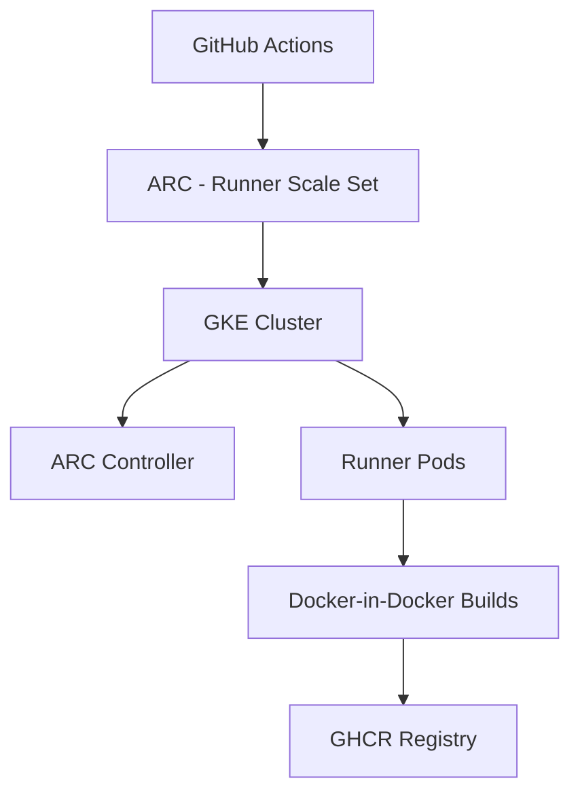
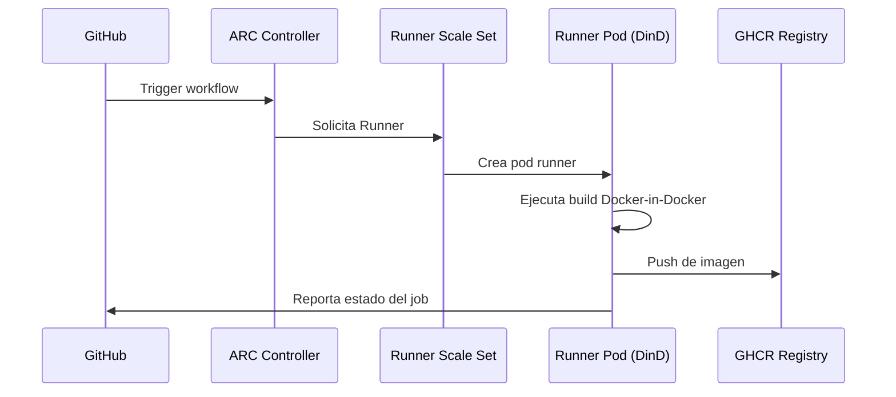

# GitHub ARC en GKE – README Completo con Diagramas

## 🚀 Descripción General
Este documento explica cómo implementar **Actions Runner Controller (ARC)** en **Google Kubernetes Engine (GKE)**, configurar *runner scale sets* y habilitar **Docker-in-Docker (dind)** para ejecutar flujos de GitHub Actions dentro de Kubernetes.

---

# 🧩 Arquitectura General



---

# 1️⃣ Crear el clúster de GKE

```bash
export PROJECT_ID="PROYECTO_GOOGLE"
export REGION="us-central1"
export ZONE="${REGION}-a"
export CLUSTER_NAME="arc-gke-standard"
export MACHINE_TYPE="e2-standard-4"
export NODE_COUNT="1"

gcloud config set project $PROJECT_ID

gcloud container clusters create $CLUSTER_NAME \
  --zone $ZONE \
  --num-nodes $NODE_COUNT \
  --machine-type $MACHINE_TYPE \
  --image-type UBUNTU_CONTAINERD \
  --disk-size 100 \
  --metadata disable-legacy-endpoints=true \
  --workload-pool="${PROJECT_ID}.svc.id.goog" \
  --enable-network-policy \
  --enable-autoupgrade \
  --enable-autorepair \
  --no-enable-shielded-nodes

gcloud container clusters get-credentials $CLUSTER_NAME --zone $ZONE
kubectl get nodes -o wide
```

---

# 2️⃣ Desplegar ARC Controller

```bash
export ARC_NAMESPACE="arc-systems"

helm install arc \
  --namespace "${ARC_NAMESPACE}" \
  --create-namespace \
  oci://ghcr.io/actions/actions-runner-controller-charts/gha-runner-scale-set-controller


kubectl get pods -n ${ARC_NAMESPACE}
```

---

# 3️⃣ Crear Token de GitHub y configurar runners

```bash
export GITHUB_PAT="PON_AQUI_TU_TOKEN"
export RUNNERS_NAMESPACE="arc-runners"
export INSTALLATION_NAME="arc-runner-set"
export GITHUB_CONFIG_URL="https://github.com/TU_ORG"

helm install "${INSTALLATION_NAME}" \
  --namespace "${RUNNERS_NAMESPACE}" \
  --create-namespace \
  --set githubConfigUrl="${GITHUB_CONFIG_URL}" \
  --set githubConfigSecret.github_token="${GITHUB_PAT}" \
  --set containerMode.type="dind" \
  --set dind.privileged=true \
  oci://ghcr.io/actions/actions-runner-controller-charts/gha-runner-scale-set


kubectl get pods -n ${RUNNERS_NAMESPACE}
```

---

# 🏗️ Diagrama del flujo CI/CD con ARC



---

# 4️⃣ Workflow de prueba: `.github/workflows/01-test-arc.yml`

```yaml
name: 01 - Test ARC

on:
  workflow_dispatch:

jobs:
  test:
    runs-on: arc-runner-set
    steps:
      - uses: actions/checkout@v4
      - name: Info del runner
        run: |
          echo "ARC está funcionando en GKE"
          uname -a
          hostname
```

---

# 5️⃣ Dockerfile de ejemplo

```dockerfile
FROM alpine:3.20
RUN apk add --no-cache curl
CMD ["sh", "-c", "echo 'Hola desde ARC con dind en GKE'"]
```

---

# 6️⃣ Workflow de build Docker-in-Docker

```yaml
name: 02 - Build & Push Docker-in-Docker

on:
  workflow_dispatch:

env:
  REGISTRY: ghcr.io
  IMAGE_NAME: ${{ github.repository_owner }}/arc-lab-demo

jobs:
  build:
    runs-on: arc-runner-set

    permissions:
      contents: read
      packages: write

    steps:
      - uses: actions/checkout@v4

      - name: Login en GHCR
        run: |
          echo "${{ github.token }}" | docker login ghcr.io             -u ${{ github.actor }} --password-stdin

      - name: Build de la imagen
        run: |
          IMAGE="${{ env.REGISTRY }}/${{ env.IMAGE_NAME }}:${{ github.sha }}"
          docker build -t "$IMAGE" .

      - name: Push de la imagen
        run: |
          IMAGE="${{ env.REGISTRY }}/${{ env.IMAGE_NAME }}:${{ github.sha }}"
          docker push "$IMAGE"

      - name: Test local del contenedor
        run: |
          IMAGE="${{ env.REGISTRY }}/${{ env.IMAGE_NAME }}:${{ github.sha }}"
          docker run --rm "$IMAGE"
```

---

# ✔️ Resultado Final

Con este setup:

- GKE ejecuta runners de GitHub Actions
- ARC administra los runners dinámicamente
- Se soporta Docker-in-Docker totalmente funcional
- Puedes construir y publicar imágenes en GHCR desde Kubernetes

---

¿Necesitas agregar diagramas adicionales, badges o una versión en inglés?  
¡Puedo generarlo también!
